<picture>
  <source media="(prefers-color-scheme: dark)" srcset="assets/banner-dark.svg">
  
</picture>

<p align="center">
  <a href="https://oldcircle.github.io"></a>
  <a href="https://oldcircle.github.io/?lang=zh"></a>
  <a href="https://arxiv.org/abs/2603.20017"></a>
</p>

I make agent skills, developer tools and browser games. The ones I like best refuse to guess: a claim has to name the file it came from, observations are sealed before any reasoning starts, and every number is run before it goes on the page. AI master's student at Harbin Institute of Technology, Shenzhen.

## Selected work

<table>
<tr>
<td width="50%" valign="top">

<a href="https://github.com/Oldcircle/geo-sleuth">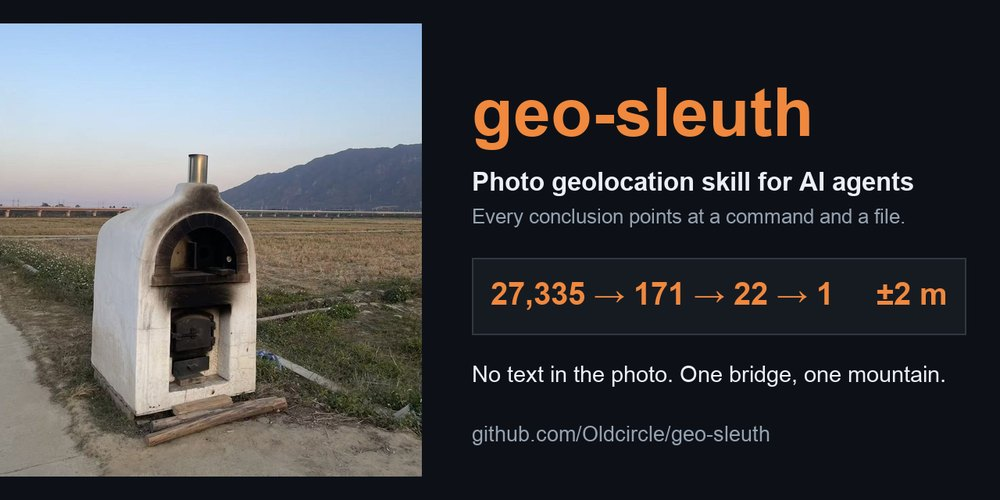</a>

**[🧭 geo-sleuth](https://github.com/Oldcircle/geo-sleuth)** &nbsp;<a href="https://github.com/Oldcircle/geo-sleuth/stargazers"></a>

Finds where a photo was taken, and shows its work. No text, no plates, no landmarks: one bridge and one mountain put the camera within 2 m.

```bash
npx skills add Oldcircle/geo-sleuth
```

</td>
<td width="50%" valign="top">

<a href="https://github.com/Oldcircle/holmes-skill">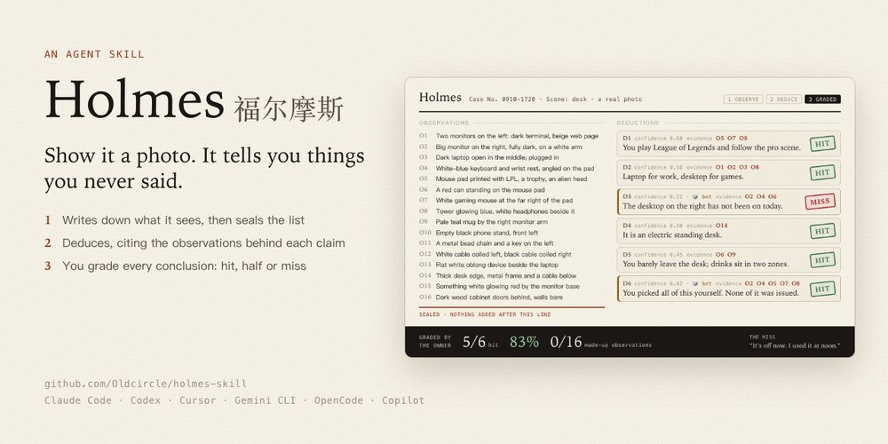</a>

**[🔍 Holmes 福尔摩斯](https://github.com/Oldcircle/holmes-skill)**

Reads a photo the way Sherlock Holmes reads a stranger. Observations are sealed before any deduction; on a real desk photo the owner graded 5 hits, 1 miss, 0 made-up observations.

```bash
npx skills add Oldcircle/holmes-skill
```

</td>
</tr>
</table>

<sub>Both are plain Agent Skills and work in Claude Code, Codex, Cursor, Gemini CLI, OpenCode and GitHub Copilot.</sub>

## Tools for agents

| Project | What it does |
|---|---|
| 🪴 **[Trellis](https://github.com/Oldcircle/trellis)** | The discipline layer for file-based agent memory: budgets, ownership rules, and a linter that keeps `CLAUDE.md` and `MEMORY.md` from rotting. |
| 🎓 **[deep‑lecture](https://github.com/Oldcircle/claude-skills)** | A teaching method as a Claude Code skill: read the primary sources, run every number, publish one interactive page, patch it wherever the learner gets lost. *In Chinese.* |
| 🪟 **[wsl‑agent‑kit](https://github.com/Oldcircle/wsl-agent-kit)** | One double-click on Windows sets up WSL2, your pick of nine AI agents and a Chinese office workspace. *In Chinese.* |
| ⚡ **[ai‑shell](https://github.com/Oldcircle/ai-shell)** | Build your own Claude Code from scratch: streaming query loop, tools, permissions, context compaction. |
| 🔬 **[trace‑viewer](https://github.com/Oldcircle/trace-viewer)** | Every LLM call, tool call and token spent in an OpenClaw agent run, laid out step by step. |

## Research

<table>
<tr>
<td width="42%"><a href="https://arxiv.org/abs/2603.20017">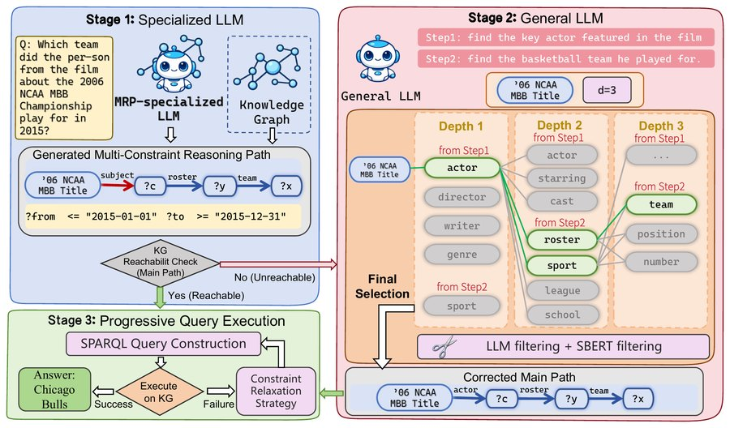</a></td>
<td valign="top">

**RouterKGQA: Specialized–General Model Routing for Constraint-Aware Knowledge Graph Question Answering**<br>
<sub>**Bo Yuan**\*, Hexuan Deng\*, Xuebo Liu, Min Zhang · AACL-IJCNLP 2026, Main Conference · \*equal contribution</sub>

A small specialized model drafts the reasoning path over the knowledge graph. A large general model is called in only when that path cannot be reached: **+3.57 F1** over the previous best, at **1.15 LLM calls** per question.

[arXiv:2603.20017](https://arxiv.org/abs/2603.20017) · [PDF](https://arxiv.org/pdf/2603.20017)

</td>
</tr>
</table>

## Simulations and visual explainers

<table>
<tr>
<td width="33%" valign="top"><a href="https://github.com/Oldcircle/backprop-viz">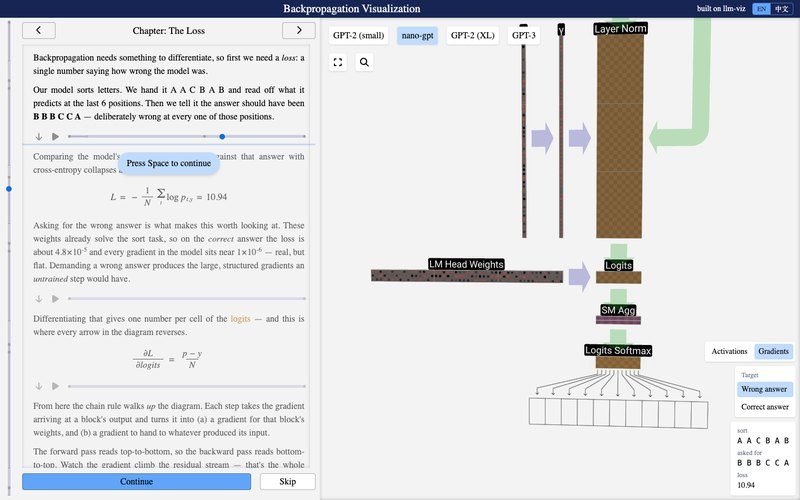</a><br><b><a href="https://github.com/Oldcircle/backprop-viz">backprop-viz</a></b><br><sub>A 3D walkthrough of a GPT's backward pass, built on llm-viz. Every block holds its gradient, computed live.</sub></td>
<td width="33%" valign="top"><a href="https://github.com/Oldcircle/anima">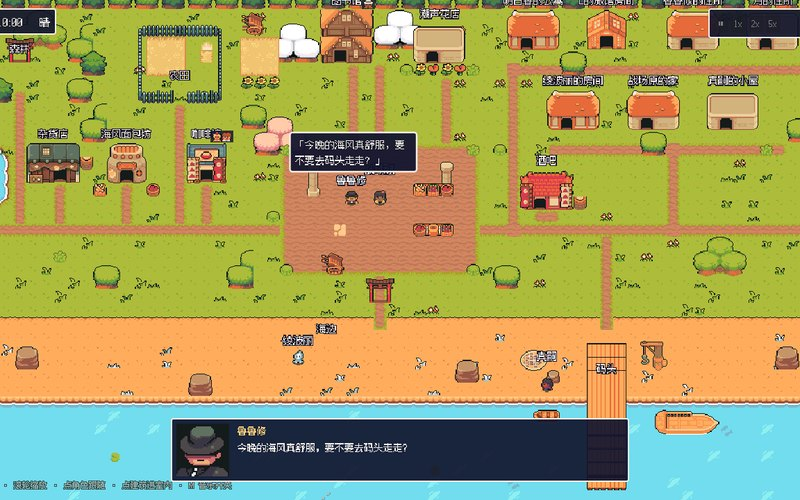</a><br><b><a href="https://github.com/Oldcircle/anima">Anima</a></b><br><sub>Seven anime characters, each its own LLM agent, in one seaside town. Friendships and grudges come out of the interactions.</sub></td>
<td width="33%" valign="top"><a href="https://oldcircle.github.io/blockfire/">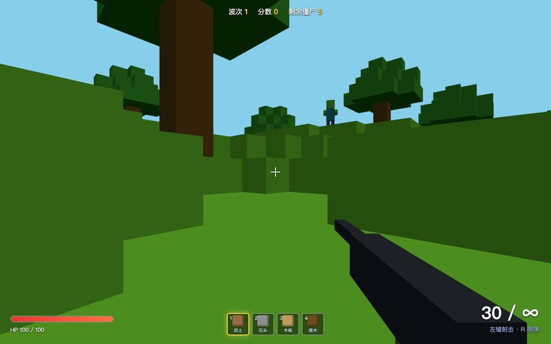</a><br><b><a href="https://oldcircle.github.io/blockfire/">BlockFire 方块火线</a></b> · <a href="https://oldcircle.github.io/blockfire/">play ↗</a><br><sub>Minecraft meets first-person shooter, in one HTML file. Dig, build walls, hold off the waves.</sub></td>
</tr>
</table>

<sub>Also: <b><a href="https://github.com/Oldcircle/stardew-anima">Stardew Anima</a></b>, an MCP server with 28 intent-level tools that let an LLM play Stardew Valley without screenshots.</sub>

## Games you can play in the browser

<table>
<tr>
<td width="25%"><a href="https://oldcircle.github.io/Xiangqi/">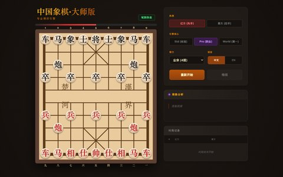</a><br><sub><b>Xiangqi</b> · Chinese chess vs an AI</sub></td>
<td width="25%"><a href="https://oldcircle.github.io/Gomoku/">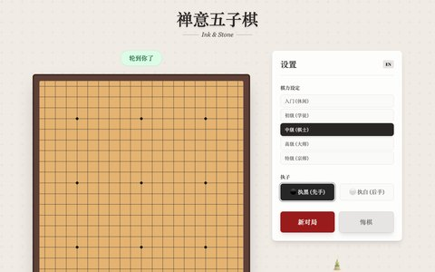</a><br><sub><b>Zen Gomoku</b> · five in a row vs an AI</sub></td>
<td width="25%"><a href="https://oldcircle.github.io/JokerPoker/">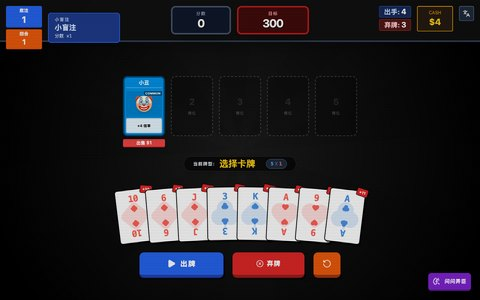</a><br><sub><b>Joker Poker</b> · a Balatro-style roguelike</sub></td>
<td width="25%"><a href="https://oldcircle.github.io/SurvivorRoyale/"></a><br><sub><b>Survivor Royale</b> · survive, hunt, evolve</sub></td>
</tr>
<tr>
<td width="25%"><a href="https://oldcircle.github.io/NeonSurvivor/">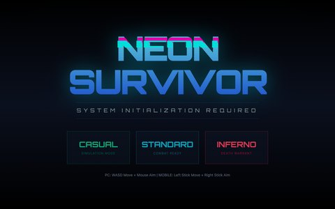</a><br><sub><b>Neon Survivor</b> · twin-stick zombie shooter</sub></td>
<td width="25%"><a href="https://oldcircle.github.io/Alpine-Escape/">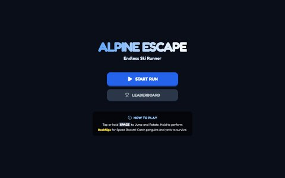</a><br><sub><b>Alpine Escape</b> · an endless ski run</sub></td>
<td width="25%"><a href="https://oldcircle.github.io/Holiday-Memories-3D/">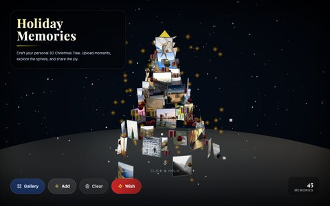</a><br><sub><b>Holiday Memories</b> · photos as a 3D tree</sub></td>
<td width="25%"><a href="https://oldcircle.github.io/Gradient-Puzzle/"></a><br><sub><b>Lumina</b> · put the gradient back in order</sub></td>
</tr>
</table>

## Upstream

- [moeru-ai/airi#1333](https://github.com/moeru-ai/airi/pull/1333): fix(telegram-bot): velin rendering, action loop and LLM compatibility · merged
- [lbjlaq/Antigravity-Manager#2286](https://github.com/lbjlaq/Antigravity-Manager/pull/2286): fix(proxy): dynamic pro model fallback with account-aware remapping · merged

<details>
<summary>Earlier projects</summary>
<br>

- [StoryForge](https://github.com/Oldcircle/storyforge): one sentence in, one comic or short-drama episode out
- [ChromaCheck AI](https://github.com/Oldcircle/ChromaCheckAI): colour palettes from a description, with Gemini, DeepSeek or OpenAI
- [paper-tl](https://github.com/Oldcircle/paper-tl): upload a paper PDF, read a Chinese translation laid out for a phone
- [LinkStream](https://github.com/Oldcircle/LinkStream): a phone and PC sync assistant

</details>

<p align="center"><sub><a href="https://oldcircle.github.io">oldcircle.github.io</a> · <a href="https://oldcircle.github.io/?lang=zh">中文主页</a></sub></p>
